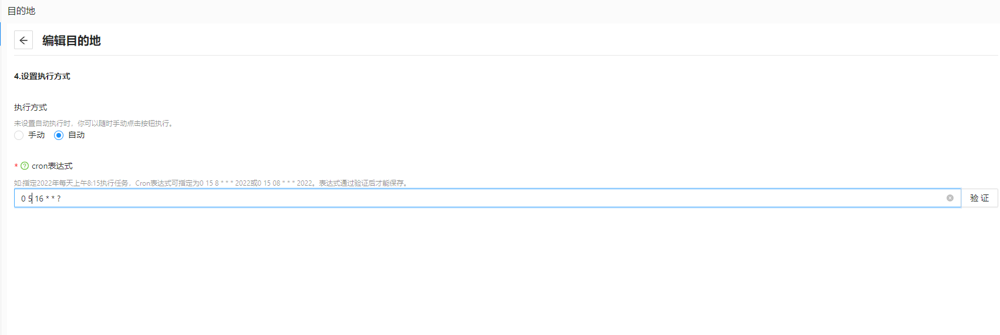

# 工具介绍
dataSmith是一款数据自动化导出工具，可配置cron表达式实现数据自动化导出，目前已集成飞书多维表格自动导出功能 。主要模块如下
- 数据源
  - 支持如MySQL, ClickHouse、Oracle等关系数据库
  - 支持HTTP数据源配置
- 数据模型
  - 集成SQL编辑器
  - 支持数据库的Schema及table列表查看，编写SQL更方便
  - 支持对http接口响应结果的jsonPath自定义解析，适配不同数据结构解析
- 目的地
   - 可配置飞书多维表格目的地配置，全适配飞书多给表格字段属性配置；
   - 支持随时新增表格字段；
   - 支持自定义更新策略配置，包括全量、增量更新；   
   - 支持cron表达式自定义配置导出计划，并可查询最近5次执行时间；
   - 支持手动执行数据导出；
- 调度日志，导出结果及错误日志界面查询
- 用户登录
  - 目前暂时只支持SQL脚本维护登录信息

## 技术栈
- 后端：SpringBoot + MybatisPlus + Hutool + flyway + + Knife4j
- 前端：Vue2.x + Cross UI

## 配置项说明
- feishu.operation.appId 飞书应用ID
- feishu.operation.appSecret 飞书应用密钥
- knife4j.switch swagger文档开关，默认true
- crypto.key 数据库配置密码加密密钥，可配置16位字段串，程序使用AES加密方式

## 快速运行
- 配置数据库，运行程序后会自动执行数据库脚本
- 默认账号密码为：admin/123456

## 界面截图

## 许可证
[Apache License 2.0](LICENSE)

